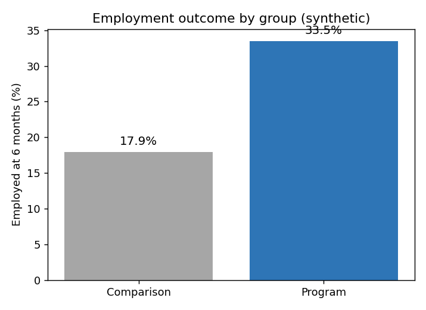

# ProgramEval — Government Program Outcome Evaluation

Evaluates whether a public program *actually worked* — going beyond the raw before/after
number to a covariate-adjusted impact estimate, a subgroup analysis, and a
cost-per-outcome figure. Built to practise the program- and outcome-evaluation methods
used in public-sector advisory work.

> **Scenario:** *Pathways to Work* (fictional youth employment program), with a
> treatment group and a comparison group. Data is **synthetic** and generated by
> `generate_data.py`. This is a methods demonstration, not a real evaluation.

## What it does
1. **Raw result** — naive difference in employment rates between groups (with a significance test)
2. **Baseline balance** — checks whether the two groups were comparable to begin with
3. **Adjusted effect** — logistic regression (average marginal effect) controlling for age, prior unemployment, education and region
4. **Subgroups** — identifies who benefits most
5. **Cost-effectiveness** — dollars per additional employment outcome

## Why it's interesting
The headline number is almost always misleading. The whole skill of evaluation is
asking *"would this have happened anyway?"* — checking baseline balance and adjusting
for confounders so you report the program's real contribution, not selection effects.
This project walks through that reasoning explicitly.

## Tech
Python · pandas · scikit-learn (logistic regression) · SciPy (hypothesis test) · matplotlib · SQLite

## Run it
```bash
pip install -r requirements.txt
python generate_data.py
python analyze.py
```

## Sample output


`outputs/evaluation_report.md` contains the full written evaluation and recommendation.

## What I'd do next
- Add propensity-score matching as an alternative to regression adjustment
- Report confidence intervals via bootstrapping
- Model a longer follow-up horizon and benefit–cost ratio

---
*Synthetic-data portfolio project. Not affiliated with any real program or agency.*
